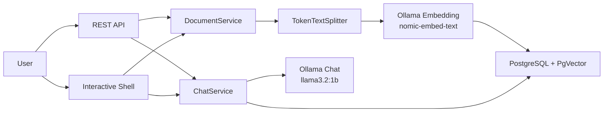

# RAG Demo

A local Retrieval-Augmented Generation demo built with Spring Boot and Spring AI.

This project demonstrates a small but complete RAG pipeline:

- ingest text or PDF documents
- split the content into chunks
- create embeddings with a local Ollama embedding model
- store vectors in PostgreSQL with PgVector
- retrieve relevant chunks for a user question
- answer through the same pipeline from either REST APIs or an interactive command prompt

The application is designed for demos and local experimentation. It does not require an OpenAI API key.

## Technology Stack

- Java 21
- Spring Boot 4.1.0
- Spring AI 2.0.0
- Spring Shell 4.0.3
- Ollama for local chat and embedding models
- PostgreSQL with PgVector for vector storage
- Docker Compose for local infrastructure
- Springdoc OpenAPI / Swagger UI

## Architecture



## Project Layout

```text
src/main/java/com/ynz/ai/rag/ragdemo/
+-- RagDemoApplication.java
+-- chat/                  # Chat request/response API and RAG orchestration
+-- document/              # Text/PDF ingestion API
+-- shell/                 # Interactive command-line interface
+-- config/                # Swagger and vector splitter configuration
+-- common/exception/      # Shared error handling
```

## Prerequisites

Install these before running the demo:

- Java 21
- Maven, or use the included Maven wrapper
- Docker Desktop

Docker Desktop must be running because the app uses Docker Compose for Ollama and PgVector.

## Local Services

The [docker-compose.yml](C:/Users/zhaoy/IdeaProjects/ragdemo/docker-compose.yml) file starts:

| Service | Container | Port | Purpose |
| --- | --- | --- | --- |
| PostgreSQL + PgVector | `rag-demo-pgvector` | `5432` | Persistent vector database |
| Ollama | `rag-demo-ollama` | `11434` | Local LLM and embedding runtime |
| Ollama model puller | `rag-demo-ollama-models` | n/a | Pulls required models once |

The configured models are:

- Chat model: `llama3.2:1b`
- Embedding model: `nomic-embed-text:latest`

The embedding model produces 768-dimensional vectors, so PgVector is configured with:

```properties
spring.ai.vectorstore.pgvector.dimensions=768
```

## Run The Application

From the project root:

```powershell
.\mvnw.cmd spring-boot:run
```

Or, if Maven is installed globally:

```powershell
mvn spring-boot:run
```

Spring Boot Docker Compose integration starts the required Docker services automatically during development runs.

The first startup may take a while because Ollama needs to download the configured models.

When the app is running:

- REST API base URL: `http://localhost:8080`
- Swagger UI: `http://localhost:8080/swagger-ui.html`
- Ollama API: `http://localhost:11434`
- PostgreSQL/PgVector: `localhost:5432`

## Interactive Shell

The application also starts an interactive Spring Shell prompt in the same terminal.

Example:

```text
shell:> ingest-text "Spring AI can build local RAG applications with Ollama and PgVector." --title "Local RAG"
shell:> ask "What does this project use for local RAG?" --top-k 3
shell:> help
shell:> exit
```

Shell commands:

| Command | Description |
| --- | --- |
| `ask "<question>" --top-k 3` | Ask a question through the RAG pipeline |
| `ingest-text "<content>" --title "<title>"` | Add text directly to the vector store |
| `help` | Show available commands |
| `exit` | Exit the shell and stop the application |

The shell and REST API use the same services underneath, so both interfaces talk to the same vector database and LLM.

## REST API

### Add Text

```powershell
curl.exe -X POST http://localhost:8080/api/documents/text `
  -H "Content-Type: application/json" `
  -d "{ `"content`": `"Spring AI supports RAG with Ollama and PgVector.`", `"title`": `"Spring AI Notes`" }"
```

Response example:

```json
{
  "documentId": "8c65528a-9eb9-4f2e-905f-456c8fe7e1e2",
  "filename": null,
  "chunksCreated": 1,
  "message": "Text content processed successfully"
}
```

### Upload A File

Text and PDF uploads are supported.

```powershell
curl.exe -X POST http://localhost:8080/api/documents/upload `
  -F "file=@notes.pdf" `
  -F "description=Demo notes"
```

### Ask A Question

```powershell
curl.exe -X POST http://localhost:8080/api/chat/query `
  -H "Content-Type: application/json" `
  -d "{ `"question`": `"What does this project use for vector storage?`", `"topK`": 3 }"
```

Response shape:

```json
{
  "answer": "...",
  "question": "What does this project use for vector storage?",
  "sources": ["..."],
  "answerMode": "RAG",
  "conversationId": null
}
```

### Endpoint Summary

| Method | Path | Status |
| --- | --- | --- |
| `POST` | `/api/documents/text` | Adds raw text to the vector store |
| `POST` | `/api/documents/upload` | Uploads a UTF-8 text file or PDF |
| `POST` | `/api/chat/query` | Answers a question |
| `POST` | `/api/chat/stream` | Placeholder, streaming is not implemented |
| `DELETE` | `/api/documents/{documentId}` | Placeholder, deletion is not implemented |

## RAG Behavior

The chat flow is intentionally simple:

1. The user asks a question.
2. The question is embedded with Ollama.
3. PgVector returns the top matching chunks.
4. If chunks are found, the prompt includes those chunks as knowledge-base context.
5. The Ollama chat model generates the answer.
6. The response includes an `answerMode`.

There are two answer modes:

| Mode | Meaning |
| --- | --- |
| `RAG` | The answer used retrieved knowledge-base chunks |
| `MODEL_KNOWLEDGE` | No matching chunks were found, so the model answered from general knowledge |

This fallback is useful for demos because an empty vector database does not make the application look broken. The response still tells the user when no RAG sources were used.

## Chunking

Document text is split with Spring AI `TokenTextSplitter`.

Current configuration:

```java
TokenTextSplitter.builder()
    .withChunkSize(800)
    .withMinChunkSizeChars(200)
    .withMinChunkLengthToEmbed(5)
    .withMaxNumChunks(10000)
    .withKeepSeparator(true)
    .withPunctuationMarks(List.of(';', '.', '!', '?', '\n'))
    .build();
```

For ordinary English prose, 800 tokens is often around 500-650 words, depending on punctuation and vocabulary.

## Configuration

Main configuration is in [application.properties](C:/Users/zhaoy/IdeaProjects/ragdemo/src/main/resources/application.properties).

Key settings:

```properties
spring.ai.model.chat=ollama
spring.ai.model.embedding=ollama
spring.ai.ollama.base-url=http://localhost:11434
spring.ai.ollama.chat.model=llama3.2:1b
spring.ai.ollama.embedding.model=nomic-embed-text:latest
spring.ai.ollama.init.pull-model-strategy=WHEN_MISSING

spring.datasource.url=jdbc:postgresql://localhost:5432/ragdemo
spring.datasource.username=ragdemo
spring.datasource.password=ragdemo
spring.ai.vectorstore.pgvector.initialize-schema=true
spring.ai.vectorstore.pgvector.index-type=HNSW
spring.ai.vectorstore.pgvector.distance-type=COSINE_DISTANCE
spring.ai.vectorstore.pgvector.dimensions=768
spring.ai.vectorstore.pgvector.table-name=vector_store

spring.docker.compose.lifecycle-management=start-only
spring.shell.interactive.enabled=true
spring.shell.noninteractive.enabled=false
```

## Useful Docker Commands

Inspect services:

```powershell
docker compose ps
```

View logs:

```powershell
docker compose logs -f ollama
docker compose logs -f postgres
```

Stop services:

```powershell
docker compose down
```

Stop services and remove persisted data:

```powershell
docker compose down -v
```

Use `down -v` when you want a clean PgVector database and fresh Ollama model volume.

## Tests

Run the test suite:

```powershell
.\mvnw.cmd test
```

Or:

```powershell
mvn test
```

## Troubleshooting

### The first run is slow

Ollama downloads `llama3.2:1b` and `nomic-embed-text:latest` on first use. Wait for the model puller container to finish.

### No RAG sources are returned

The vector database may be empty, or the indexed content may not match the question. In that case the app returns `answerMode: "MODEL_KNOWLEDGE"` and answers from the model's general knowledge.

### PgVector errors after changing embedding model

Embedding dimensions must match the PgVector table configuration. If you change `spring.ai.ollama.embedding.model`, verify its vector dimensions and update:

```properties
spring.ai.vectorstore.pgvector.dimensions=...
```

For a clean reset:

```powershell
docker compose down -v
.\mvnw.cmd spring-boot:run
```

### Swagger UI path

Swagger UI is available at:

```text
http://localhost:8080/swagger-ui.html
```

Chroma-style `/docs` pages are not part of this Spring Boot application.
